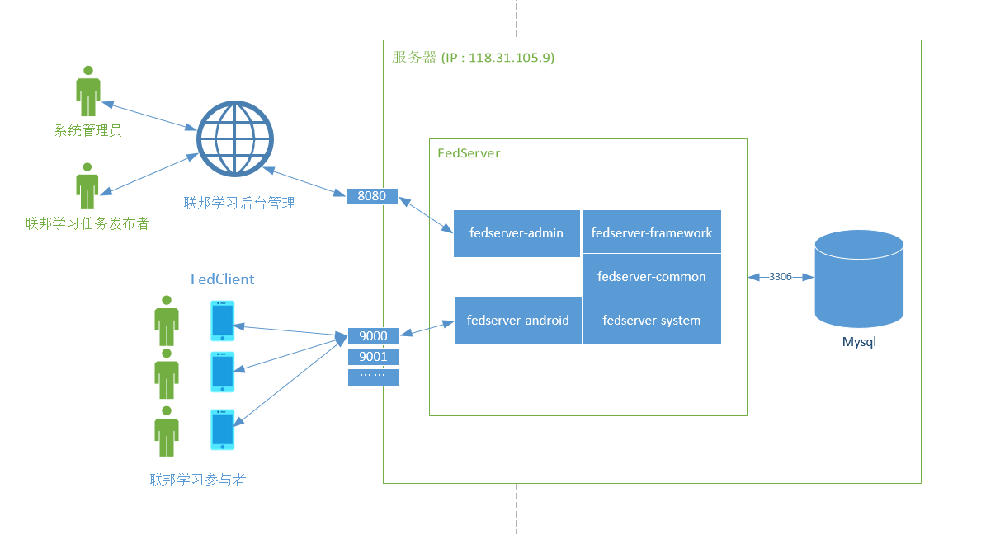

[TOC]

本仓库为联邦学习系统的简要介绍，相关源码仓库如下：

服务端地址：https://github.com/zhanghad/FedServer

客户端地址：https://github.com/zhanghad/FedClient

评价系统测试平台：https://github.com/apotoffish/vPlatform


# 系统整体架构




# 评价系统


## 模型评价


**分类模型的评价指标**

- 真正例(True Positive, **TP**)：被模型预测为正的正样本；
- 假正例(False Positive, **FP**)：被模型预测为正的负样本；
- 假负例(False Negative, **FN**)：被模型预测为负的正样本；
- 真负例(True Negative, **TN**)：被模型预测为负的负样本；


- **正确率**（Accuracy）

  ​	预测正确的结果占总样本的百分比
  $$
  Accuracy=\frac{TP+TN}{TP+TN+FP+FN}
  $$
  
- **准确率**（Precision）

  ​	在所有被预测为正的样本中实际为正的样本的概率
  $$
  Precision=\frac{TP}{TP+FP}
  $$
  
- **召回率**（Recall）

  ​	在实际为正的样本中被预测为正样本的概率
  $$
  Recall=\frac{TP}{TP+FN}
  $$
  
- **F-Measure**

  ​	准确率与召回率的加权调和平均

$$
F_β=\frac{(1+β^2)×P×R}{(β^2×P)+R}
$$


分类模型要如何评价？（这里暂时采用精确度进行评价）

```java
    public double evalModel(HashMap<String, INDArray> weight) {
        MultiLayerNetwork tempModel=new MultiLayerNetwork(conf);
        tempModel.init();
        Evaluation eval = tempModel.evaluate(mnistTest);
        //返回模型的正确率，值域 [0,1]
        return eval.accuracy();
    }
```


## 声誉机制

### 声誉影响因素

**参与者行为**

- **positive** 成功完成一轮训练并且模型精度达标
- **uncertain**  中途退出训练
- **negative** 成功完成一轮训练但模型精度未达标

**时间**

- 时间越近的行为影响权重越大

$$
t(y)=Z^{y-start}\\\\
Z\in(0,1)\\\\
set\,Z=0.8
$$

```java
    private double timeEffect(Date para){
        //区分时间影响的最小单位为 min
        double diff=(para.getTime()-startTime.getTime())/(1000.0*60);
        return Math.pow(fadeWeight,diff);
    }
```


### 服务端对参与者的三个评价值

- **B (belief)** 信任
- **D (disbelief)** 不信任
- **U (uncertainty)** 不确定


$$
\left\{ 
\begin{array}{c}
B=P\cdot\frac {α\cdot\sum_{i=start}^{current} t(p_i)}{α\cdot\sum_{i=begin}^{current} t(p_i)+β\cdot\sum_{i=begin}^{current} t(n_i)} \\\\ 

D=P\cdot\frac {β\cdot\sum_{i=start}^{current} t(n_i)}{α\cdot\sum_{i=begin}^{current} t(p_i)+β\cdot\sum_{i=begin}^{current} t(n_i)} \\\\ 

U=(1-P)\cdot\sum_{i=start}^{current}t(u_i)
\\\\

P=\frac {\sum_{i=start}^{current} p_i+\sum_{i=start}^{current} n_i}{\sum_{i=begin}^{current} u_i+\sum_{i=begin}^{current}p_i+\sum_{i=begin}^{current}n_i} 
\end{array}
\right.\\\\
set\,α=0.4\\\\
set\,β=0.6\\\\
$$


### 声誉值计算

$$
T=B+aU\\\\
set\,a=0.5
$$

```java
    //声誉得分
    //声誉值取值范围 (0,1), 初始值为0.6
    public double calculateReputation(){
        double positiveEffect=0;
        double negitiveEffect=0;
        double uncertainEffect=0;
        double belief;
        double uncertainty;

        for (Date date : positive) {
            positiveEffect += timeEffect(date);
        }
        for (Date date : negative) {
            negitiveEffect += timeEffect(date);
        }
        for (Date date : uncertain) {
            uncertainEffect += timeEffect(date);
        }

        //belief 值
        belief=successProbability()*positiveWeight*
            positiveEffect/(positiveWeight*positiveEffect+negativeWeight*negitiveEffect);
        //uncertainty 值
        uncertainty=(1-successProbability())*uncertainEffect;
        //用户信誉值
        return belief+uncertainWeight*uncertainty;
    }
```


## 用户评价

声誉评分 && 设备硬件评分

硬件：

- CPU：CPU评分根据网络上的测评数据得到，测评信息存储在数据库中
- RAM：根据RAM的容量大小评价
- Storage：根据手机空余存储大小评价

```java
    private double ramScore(){
        double limit=8.0;//ram容量满分为8GB
        if(ram>=limit)
            return 1.0;
        else
            return ram/limit;
    }

    private double storageScore(){
        double limit=5.0;//storage容量满分5GB
        if(ram>=limit)
            return 1.0;
        else
            return ram/limit;
    }
```


```java
//设备硬件评价，值域 [0,1]
public double getDeviceScore(){
    return 0.8*cpuScore()+0.15*ramScore()+0.05*storageScore();
}


//用户总体评价, 值域 (0,1)
public double getClientSocre(){
    return 0.5*getDeviceScore()+0.5*clientReputation.calculateReputation();
}
```


## 用户选择

根据用户的评分选择单次全局迭代中的参与者

```java
    //根据用户的评分进行降序排序
    private void sort(){
        Collections.sort(clients, new Comparator<ClientInfo>() {
            @Override
            public int compare(ClientInfo o1, ClientInfo o2) {
                return (int) (o2.getClientSocre()-o1.getClientSocre());
            }
        });
    }


    //用户选择
    public ArrayList<ClientInfo> selectClients(int clientNum){
        ArrayList<ClientInfo> selected=new ArrayList<ClientInfo>();
        int i=0;
        int j=0;
        //排序
        this.sort();
        while(i<clients.size()){
            //参与者上限
            if(j==clientNum)
                break;
            //参与者声誉满足要求
            if(clients.get(i).clientReputation.repuIsValid()){
                selected.add(clients.get(i));
                j++;
            }
            i++;
        }
        return selected;
    }
```


## 用户激励

- 参与者评分
- 本轮模型评分

```java
//参与者奖励计算，单次奖励值域(0,1)
public double getReword(double modelScore){
    double reward=getClientSocre()*modelScore;
    income+=reward;
    return reward;
}
```


------

Created by zhanghad. 2020/7/28