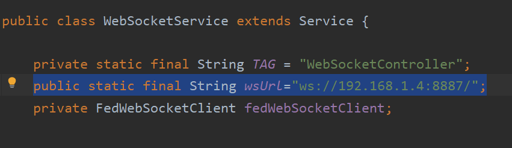
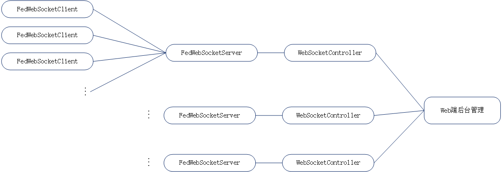
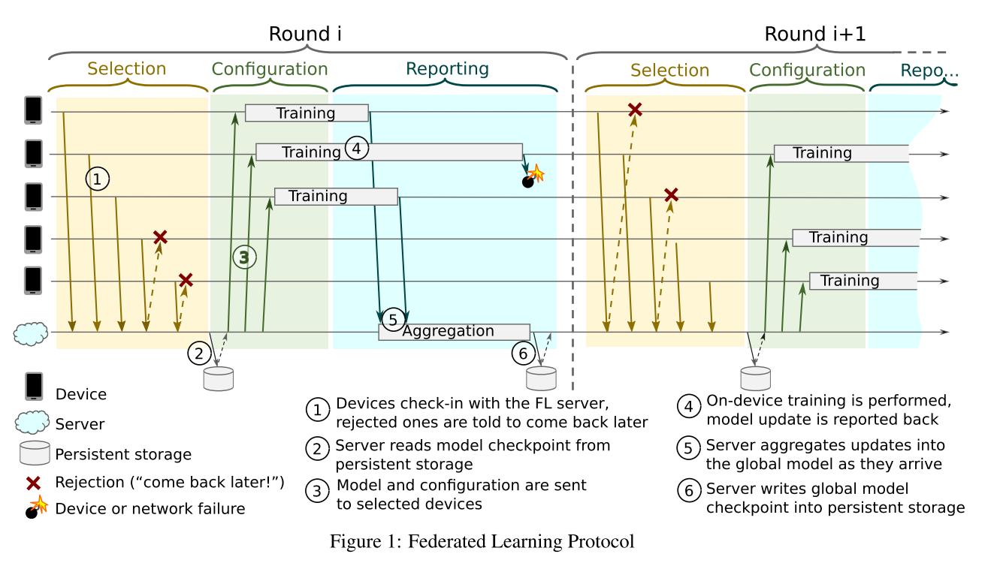
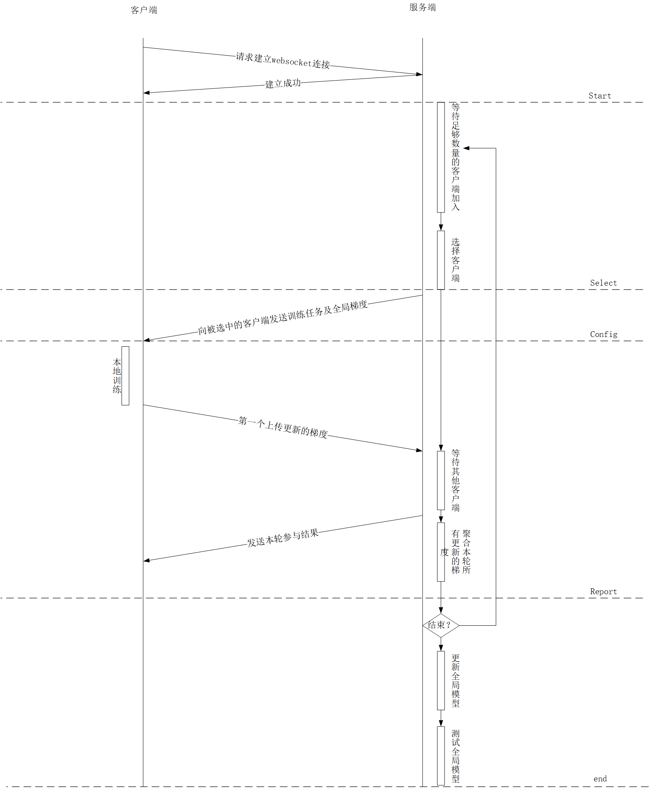

[TOC]

# 在自己的电脑上运行此项目

- FedClient 为该项目的客户端，是 Android 类型的项目，使用Android Studio打开
- FedServer 为该项目的服务端，使用 Intellij IDEA 打开此项目

此项目目前通过了本地运行测试，WebSocket使用的是内网进行测试

在本地运行项目前需修改Android项目中的ws地址，将



```
ws://192.168.1.4:8887/
```

改为

```
ws://[本机内网ip]:8887/
```

然后在Android虚拟机中运行客户端（FedClient）

服务端项目（FedServer）推荐在Intellij IDEA中打开，直接运行即可。

在Android项目的界面上点击start按钮即可开始运行。


# 系统整体架构


## 移动端

- **Client**：app主进程

- **FL Runtime**：负责模型训练任务，主进程创建一个子线程调用 FL Runtime 执行训练任务。训练任务以及训练模型的配置由Server发送给服务端。

  在执行训练任务前，训练模块会检测当前手机状态，并会有一定**运行限制**（比如手机处于空闲状态，连接WIFI，正在充电）

- **Data Manager**：管理训练数据，处理训练数据（在开始的简单的例子中，直接将数据内嵌到app中，后期会开发独立的**数据管理模块**。）

- **WebSocketClient**：维护WebSocket连接，负责与服务器进行通信。

## 服务端

- **Server**：服务端主进程
- **Web**：服务端管理模块，提供给管理人员Web接口，对系统进行管理
- **Task Manager**：负责管理联邦学习任务
- **WebSocketServer**：维护WebSocket连接，负责与客户端通信


**任务管理**



服务端可以同时执行多个联邦学习任务，每一个任务拥有独立的WebSocket服务，独立的端口。

客户端在同一时间只可加入一个联邦学习任务。


# 通信协议

## 网络应用层协议选择

**HTTP or Websocket ？**

**相同点：**

- 均为应用层协议
- 均为基于TCP协议的可靠通信协议


**不同点：**

**HTTP：**

- ​	短连接：每一次通信均需要进行三次握手
- ​	长连接：一次三次握手建立连接，建立后每次请求客户端只需要发送一个request请求	

特点：

- ​	请求只能由客户端主动发起，服务器被动接收请求并做出反应，通信只可以单向进行
- ​	实时性弱（要实现实时通信，可采用轮询的方式，开销较大）
- ​	每条信息均有HTTP的包头，产生额外的通信开销


**WebSocket：**

首先客户端通过一次HTTP请求与服务器建立一个持久性连接，之后的通信直接通过TCP连接进行。

特点：

- 全双工通信，通信可双向进行，服务端可主动向客户端推送消息
- 实时性强
- 建立连接后，通信没有额外的包头，减少了冗余信息，通信开销低
- 可以自定义通信协议，设计数据包格式
- 对网络状况要求高，需对**断连情况**设计好处理方法
- WebSocket默认最大并发数为200，可修改


**暂定 WebSocket**


## 通信协议设计

《Towards Federated Learning at Scale: System Design》



**联邦学习中客户端与服务端的通信**




## start

开始联邦学习任务


## Select

**选择哪些client加入新一轮训练？**（**clients选择算法**）

选择依据：

1. client评价：
   - client设备的状态（CPU，存储，网络状况）
   - 历史参与信息
   - 其他反映client价值的信息
2. 训练计划
   - 选择合适数量的client参与一轮训练

根据计划，达到指定clients数量时进行下一阶段。


## Config

在配置阶段，server会向selection阶段选择的clients发送相关的信息，包括

**发送哪些配置信息？**（**数据结构设计**）

- 全局模型（梯度信息，配置信息）
- 训练计划


## Report

client在训练完之后向server上传更新模型（**安全，隐私**），server对所有更新梯度进行聚合（**聚合算法**）

server在收到本轮第一个更新的梯度后开始计时，超时的梯度将不再接收。

约束：

- 完成report的clients数目达到最低限制
- 在规定时间内完成

如果规定时间内未接收到最低数量的更新的梯度则本轮训练失败，将会重新开始本轮训练。


## end

成功完成规定轮数或者全局模型的精度达标后 server 会更新全局模型，生成最后的训练结果。


# 通信协议（系统健壮性）

## 用户设备限制

### 客户端限制

加入联邦学习的设备的硬件有以下几个方面的要求：

- 网络 （wifi / 4G / 5G）
- CPU （待定）
- 内存（大于等于64G）
- 电源（充电中）

### 服务端客户选择

根据用户的设备硬件水平，网络状态，**历史参与记录**择优选择以保证尽可能多的用户可以完成训练。


## 心跳检测

客户端与服务端定期发送心跳包以检查 WebSocket 长连接状态是否良好。

- 心跳包内容
- 发送间隔（小于1min）
- 超时时长（待定）


## 重连机制

客户端在检测到连接异常（连接断开或连接不可用）后，会自动向服务端发起重连。


1. ### 感知何时需要重连

   需要重连的场景有三种

   ​	1.**连接断开**

   ​	2.**连接未断但是不可用**

   ​	3.**连接对端的服务失效**

   

   连接断开可以直接被检测到，检测到后直接发起重连。

   后两种情况可以用心跳包来检测，如果客户端发送心跳包未在规定时间内收到服务端的回信，则可以判定为需要重连。

   

   定时发送心跳包的检测机制比较稳定，但是要想做到**快速检测**，就必须加快心跳包的发送频率，这样会加大网络的负担，因此心跳包检测作为一种保底的检测方案。

   

   

   

   

   断网，切换网络是导致连接不可用的主要原因，所以设备的网络状态从offline到online大多数情况需要重连，因此在设备的网络状态从offline转到online时发送一次心跳包检测连接是否可用。

   

   

   

   

   因此感知何时需要重连的方案为：

   ​	1.**定期发送心跳包检测连接状态**

   ​	2.**移动设备的网络状态由offline转为online时发送一次心跳包**

   

   

2. ### 快速断开旧连接

   在发起新连接前，必须断开旧连接，这样做一是为了避免误从旧连接收发数据，二是为了释放客户端和服务端的资源。

   

   TCP 的连接状态由服务端维持，因此大多数情况应由服务器断开连接。如果客户端想要断开连接，必须通知服务端，让其断开连接。

   当旧连接可用时，客户端可以直接通知服务端断开连接；当旧连接不可用时，服务端将等到超时才会断开 TCP 连接。

   

   因为 TCP 协议无法修改，连接不可用时只能等待超时断开，因此要做到**快速断开旧连接**，就要在客户端应用逻辑上**直接将旧连接弃用**，并将其与新连接隔离，保证旧连接失效，不影响新连接的信息收发。

   

3. ### 快速发起新连接

   当设备需要重连时，不可以直接发起重连，因为如果发生**网络抖动**时，所有设备同时发起重连，会给服务器带来很大的压力，因此要设计重连时的**退避算法**。

   传输层的TCP协议已经有了指数回退算法，但是为了尽可能的避免同时重连，应用层也需要有退避算法。

   算法的核心思想是使用随机数让设备推迟一段时间后再向服务器发起重连请求。不过对于网络状态从offline到online的设备，应该直接发起重连。

   


# 评价系统


## 模型评价


**分类模型的评价指标**

- 真正例(True Positive, **TP**)：被模型预测为正的正样本；
- 假正例(False Positive, **FP**)：被模型预测为正的负样本；
- 假负例(False Negative, **FN**)：被模型预测为负的正样本；
- 真负例(True Negative, **TN**)：被模型预测为负的负样本；


- **正确率**（Accuracy）

  ​	预测正确的结果占总样本的百分比
  $$
  Accuracy=\frac{TP+TN}{TP+TN+FP+FN}
  $$
  
- **准确率**（Precision）

  ​	在所有被预测为正的样本中实际为正的样本的概率
  $$
  Precision=\frac{TP}{TP+FP}
  $$
  
- **召回率**（Recall）

  ​	在实际为正的样本中被预测为正样本的概率
  $$
  Recall=\frac{TP}{TP+FN}
  $$
  
- **F-Measure**

  ​	准确率与召回率的加权调和平均

$$
F_β=\frac{(1+β^2)×P×R}{(β^2×P)+R}
$$


分类模型要如何评价？（这里暂时采用精确度进行评价）

```java
    public double evalModel(HashMap<String, INDArray> weight) {
        MultiLayerNetwork tempModel=new MultiLayerNetwork(conf);
        tempModel.init();
        Evaluation eval = tempModel.evaluate(mnistTest);
        //返回模型的正确率，值域 [0,1]
        return eval.accuracy();
    }
```


## 声誉机制

### 声誉影响因素

**参与者行为**

- **positive** 成功完成一轮训练并且模型精度达标
- **uncertain**  中途退出训练
- **negative** 成功完成一轮训练但模型精度未达标

**时间**

- 时间越近的行为影响权重越大

$$
t(y)=Z^{y-start}\\\\
Z\in(0,1)\\\\
set\,Z=0.8
$$

```java
    private double timeEffect(Date para){
        //区分时间影响的最小单位为 min
        double diff=(para.getTime()-startTime.getTime())/(1000.0*60);
        return Math.pow(fadeWeight,diff);
    }
```


### 服务端对参与者的三个评价值

- **B (belief)** 信任
- **D (disbelief)** 不信任
- **U (uncertainty)** 不确定


$$
\left\{ 
\begin{array}{c}
B=P\cdot\frac {α\cdot\sum_{i=start}^{current} t(p_i)}{α\cdot\sum_{i=begin}^{current} t(p_i)+β\cdot\sum_{i=begin}^{current} t(n_i)} \\\\ 

D=P\cdot\frac {β\cdot\sum_{i=start}^{current} t(n_i)}{α\cdot\sum_{i=begin}^{current} t(p_i)+β\cdot\sum_{i=begin}^{current} t(n_i)} \\\\ 

U=(1-P)\cdot\sum_{i=start}^{current}t(u_i)
\\\\

P=\frac {\sum_{i=start}^{current} p_i+\sum_{i=start}^{current} n_i}{\sum_{i=begin}^{current} u_i+\sum_{i=begin}^{current}p_i+\sum_{i=begin}^{current}n_i} 
\end{array}
\right.\\\\
set\,α=0.4\\\\
set\,β=0.6\\\\
$$


### 声誉值计算

$$
T=B+aU\\\\
set\,a=0.5
$$

```java
    //声誉得分
    //声誉值取值范围 (0,1), 初始值为0.6
    public double calculateReputation(){
        double positiveEffect=0;
        double negitiveEffect=0;
        double uncertainEffect=0;
        double belief;
        double uncertainty;

        for (Date date : positive) {
            positiveEffect += timeEffect(date);
        }
        for (Date date : negative) {
            negitiveEffect += timeEffect(date);
        }
        for (Date date : uncertain) {
            uncertainEffect += timeEffect(date);
        }

        //belief 值
        belief=successProbability()*positiveWeight*
            positiveEffect/(positiveWeight*positiveEffect+negativeWeight*negitiveEffect);
        //uncertainty 值
        uncertainty=(1-successProbability())*uncertainEffect;
        //用户信誉值
        return belief+uncertainWeight*uncertainty;
    }
```


## 用户评价

声誉评分 && 设备硬件评分

硬件：

- CPU：CPU评分根据网络上的测评数据得到，测评信息存储在数据库中
- RAM：根据RAM的容量大小评价
- Storage：根据手机空余存储大小评价

```java
    private double ramScore(){
        double limit=8.0;//ram容量满分为8GB
        if(ram>=limit)
            return 1.0;
        else
            return ram/limit;
    }

    private double storageScore(){
        double limit=5.0;//storage容量满分5GB
        if(ram>=limit)
            return 1.0;
        else
            return ram/limit;
    }
```


```java
//设备硬件评价，值域 [0,1]
public double getDeviceScore(){
    return 0.8*cpuScore()+0.15*ramScore()+0.05*storageScore();
}


//用户总体评价, 值域 (0,1)
public double getClientSocre(){
    return 0.5*getDeviceScore()+0.5*clientReputation.calculateReputation();
}
```


## 用户选择

根据用户的评分选择单次全局迭代中的参与者

```java
    //根据用户的评分进行降序排序
    private void sort(){
        Collections.sort(clients, new Comparator<ClientInfo>() {
            @Override
            public int compare(ClientInfo o1, ClientInfo o2) {
                return (int) (o2.getClientSocre()-o1.getClientSocre());
            }
        });
    }


    //用户选择
    public ArrayList<ClientInfo> selectClients(int clientNum){
        ArrayList<ClientInfo> selected=new ArrayList<ClientInfo>();
        int i=0;
        int j=0;
        //排序
        this.sort();
        while(i<clients.size()){
            //参与者上限
            if(j==clientNum)
                break;
            //参与者声誉满足要求
            if(clients.get(i).clientReputation.repuIsValid()){
                selected.add(clients.get(i));
                j++;
            }
            i++;
        }
        return selected;
    }
```


## 用户激励

- 参与者评分
- 本轮模型评分

```java
//参与者奖励计算，单次奖励值域(0,1)
public double getReword(double modelScore){
    double reward=getClientSocre()*modelScore;
    income+=reward;
    return reward;
}
```


# 进一步工作

- ## 核心模块搭建

  - **通信协议**进一步优化

  - 解决**通信效率**优化问题（主要是模型压缩）

  - **评价系统**进一步优化

  - **激励机制**进一步优化

  - **数据管理模块**实现（解决数据异构性问题）

  - 各类型**学习任务**实现

    

  ## 系统搭建

  目标：搭建一个可以进行测试的平台，进行系统测试及调优

  - 系统需求分析
- 系统设计
  - 实现与部署
- 测试及优化


------

Created by zhanghad. 2020/7/28
